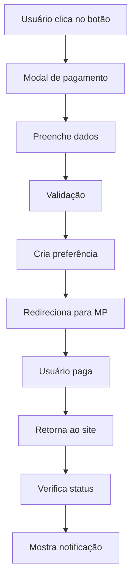

# 💳 Sistema de Pagamento - MercadoPago

Este documento explica como configurar e usar o sistema de pagamento integrado ao MercadoPago.

## 🚀 Funcionalidades Implementadas

### ✅ **Sistema Completo de Pagamento**
- Integração com API do MercadoPago
- Modal de pagamento otimizado
- Validação de dados do usuário
- Modo de demonstração para desenvolvimento
- Verificação de status de pagamento
- Notificações toast para feedback
- Persistência de dados no localStorage

### ✅ **Componentes Criados**
- `SupportModal`: Modal principal de pagamento
- `SupportButton`: Botão flutuante de apoio
- `PaymentStatusChecker`: Verificador de status
- `MercadoPagoService`: Serviço de integração
- `usePayment`: Hook para gerenciar pagamentos

## 🔧 Configuração

### 1. **Variáveis de Ambiente**

Adicione ao seu arquivo `.env`:

```env
VITE_MERCADOPAGO_ACCESS_TOKEN=seu_access_token_aqui
```

### 2. **Obter Access Token do MercadoPago**

1. Acesse [MercadoPago Developers](https://www.mercadopago.com.br/developers)
2. Crie uma conta ou faça login
3. Vá para "Credenciais"
4. Copie o Access Token (Production ou Sandbox)

### 3. **Configurações do Produto**

As configurações do produto estão em `src/config/mercadopago.ts`:

```typescript
PRODUCT: {
  TITLE: 'Apoio ao Cinemind AI',
  DESCRIPTION: 'Contribuição para manter o projeto gratuito e em evolução',
  PRICE: 5.00,
  CURRENCY: 'BRL',
  QUANTITY: 1
}
```

## 🎯 Como Usar

### **Para Desenvolvedores**

#### 1. **Modo de Demonstração**
Se o token não estiver configurado, o sistema funciona em modo de demonstração:
- Não faz requisições reais para o MercadoPago
- Simula respostas da API
- Mostra aviso visual no modal

#### 2. **Modo de Produção**
Com token configurado:
- Integração completa com MercadoPago
- Pagamentos reais processados
- Webhooks para notificações

### **Para Usuários**

#### 1. **Clicar no Botão de Apoio**
- Botão flutuante no canto inferior direito
- Ícone de coração com efeito hover

#### 2. **Preencher Dados**
- Nome completo (obrigatório)
- E-mail válido (obrigatório)
- Validação em tempo real

#### 3. **Processar Pagamento**
- Redirecionamento para MercadoPago
- Nova aba para checkout
- Múltiplas formas de pagamento

#### 4. **Retorno e Confirmação**
- Retorno automático após pagamento
- Notificação de status
- Limpeza automática de dados

## 🔄 Fluxo de Pagamento



## 🛠️ Arquivos Principais

### **Componentes**
- `src/components/SupportModal.tsx` - Modal principal
- `src/components/SupportButton.tsx` - Botão flutuante
- `src/components/PaymentStatusChecker.tsx` - Verificador de status

### **Serviços**
- `src/services/mercadopagoService.ts` - Integração com API
- `src/hooks/usePayment.ts` - Hook de pagamento
- `src/config/mercadopago.ts` - Configurações

## 🔒 Segurança

### **Dados Sensíveis**
- Token do MercadoPago em variáveis de ambiente
- Dados do usuário salvos apenas localmente
- Limpeza automática após pagamento

### **Validações**
- Validação de e-mail em tempo real
- Verificação de campos obrigatórios
- Sanitização de dados

## 📱 Responsividade

### **Design Adaptativo**
- Modal responsivo para mobile
- Botão flutuante otimizado
- Animações suaves

### **UX Otimizada**
- Loading states
- Feedback visual
- Transições suaves

## 🧪 Testes

### **Modo de Demonstração**
```bash
# Sem token configurado
npm run dev
# Sistema funciona em modo demo
```

### **Modo de Produção**
```bash
# Com token configurado
VITE_MERCADOPAGO_ACCESS_TOKEN=seu_token npm run dev
# Sistema integrado com MercadoPago
```

## 🚨 Troubleshooting

### **Problemas Comuns**

#### 1. **Token não configurado**
- Sistema funciona em modo demo
- Aviso visual no modal
- Log no console

#### 2. **Erro na API**
- Toast de erro
- Log detalhado no console
- Fallback para modo demo

#### 3. **Pagamento não processado**
- Verificação de status
- Notificação de erro
- Opção de tentar novamente

## 📈 Métricas

### **Dados Coletados**
- Timestamp do pagamento
- Dados do usuário (nome/email)
- ID da preferência
- Status do pagamento

### **Analytics**
- Taxa de conversão
- Tempo de processamento
- Erros de pagamento

## 🔮 Próximas Melhorias

### **Funcionalidades Planejadas**
- [ ] Múltiplos valores de contribuição
- [ ] Pagamento recorrente
- [ ] Histórico de pagamentos
- [ ] Dashboard de doações
- [ ] Integração com outros gateways

### **Otimizações**
- [ ] Cache de preferências
- [ ] Retry automático
- [ ] Analytics avançado
- [ ] A/B testing

## 📞 Suporte

Para dúvidas sobre o sistema de pagamento:
- Documentação do MercadoPago: [developers.mercadopago.com](https://developers.mercadopago.com)
- Configuração de webhooks
- Troubleshooting de integração 